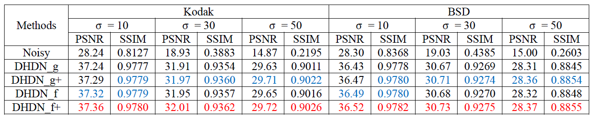
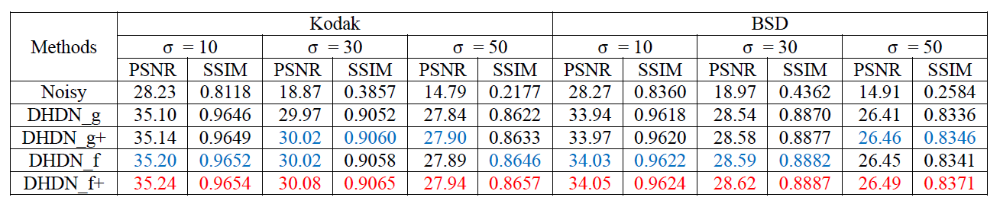

# DHDN
Pytorch Implementation of "[Densely Connected Hierarchical Network for Image Denoising](http://openaccess.thecvf.com/content_CVPRW_2019/papers/NTIRE/Park_Densely_Connected_Hierarchical_Network_for_Image_Denoising_CVPRW_2019_paper.pdf)"

Second place winner of sRGB track and Third place winner of Raw-RGB track on [NTIRE 2019 Challenge on Real Image Denoising](http://www.vision.ee.ethz.ch/ntire19/) ([result paper](http://openaccess.thecvf.com/content_CVPRW_2019/papers/NTIRE/Abdelhamed_NTIRE_2019_Challenge_on_Real_Image_Denoising_Methods_and_Results_CVPRW_2019_paper.pdf))

If you find our project useful in your research, please consider citing:

```
@inproceedings{park2019densely,
  title={Densely connected hierarchical network for image denoising},
  author={Park, Bumjun and Yu, Songhyun and Jeong, Jechang},
  booktitle={Proceedings of the IEEE Conference on Computer Vision and Pattern Recognition Workshops},
  year={2019}
```

# Related work
Pytorch Implementation of "[Deep Iterative Down-Up CNN for Image Denoising](http://openaccess.thecvf.com/content_CVPRW_2019/papers/NTIRE/Yu_Deep_Iterative_Down-Up_CNN_for_Image_Denoising_CVPRW_2019_paper.pdf)", second place winner of Raw-RGB track and third place winner of sRGB track is available in [here](https://github.com/SonghyunYu/DIDN)

# Dependencies
python 3.6    
pytorch 1.0.0    
MATLAB

# Data
We used [DIV2K](http://www.vision.ee.ethz.ch/~timofter/publications/Agustsson-CVPRW-2017.pdf) dataset for training. ([download](https://data.vision.ee.ethz.ch/cvl/DIV2K/))    
To generate training patches, use the matlab codes in ./data    
We used Kodak and BSD datasets for test datset.    
These datasets also needs to be modified by matlab codes in ./data to use our test codes.

# Training
As an example, use the following command to use our training codes
```
python main_color.py --batchSize 16 --lr 1e-4 --step 3 --cuda True --train ./data/train.h5 --valid ./data/valid.h5 --gpu 0,1 --checkpoint ./checkpoint
```
There are other options you can choose.    
Please refer to the code.  

# Test
As an example, use the following command to use our test codes
```
python test_color.py --cuda True --model1 ./trained.pth --data ./data/noisy.mat --gt ./data/gt.mat --gpu 0 --result ./result/
```
There are other options you can choose.    
Please refer to the code.

To use our pretrained model, please download [here](https://drive.google.com/open?id=1RUQuCCcPmvdfY2N6feBGPywJsWx-bRZa)    
Test results are also available in ./data/results

# Results
We retrained our network as we found some problems of our paper version trained parameters.    
So the result of the provided pretrained models is a bit different from the paper.    
These results can be obtained directly from our test codes.    

Color:    


Gray:    


Note that some results can be a little bit different if you calculate PSNR and SSIM with MATLAB.

# Contact
If you have any question about the code or paper, please feel free to contact kkbbbj@gmail.com

